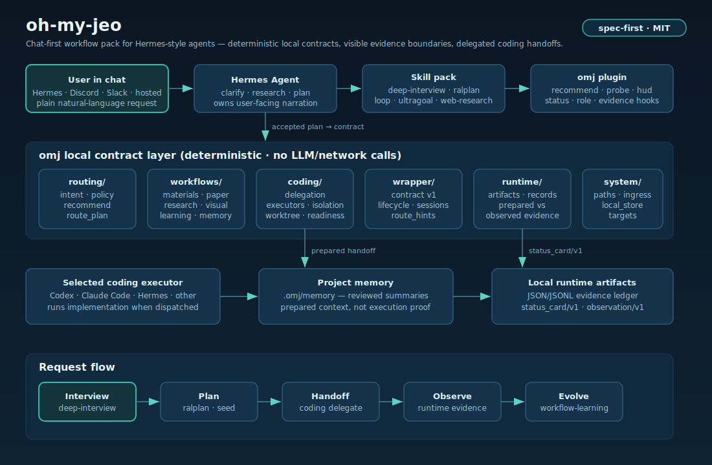
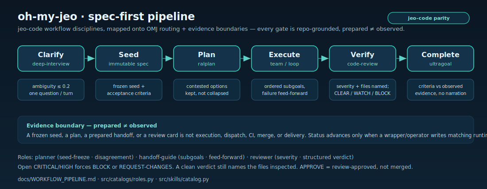
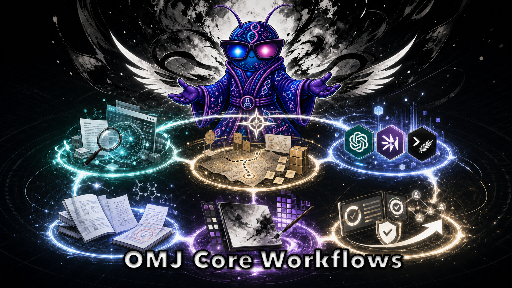

# oh-my-jeo

<p align="center">
  
</p>

<p align="center">
  <strong>Install once. Keep your agent chat. Let oh-my-jeo make the next step safe.</strong>
  <br>
  <em>Chat-first workflow skills, deterministic contracts, status cards, and delegated coding handoffs for Hermes-style agents.</em>
</p>

<p align="center">
  <a href="https://github.com/akillness/oh-my-jeo"></a>
  <a href="https://github.com/akillness/oh-my-jeo/actions/workflows/ci.yml"></a>
  <a href="https://github.com/akillness/oh-my-jeo/releases"></a>
  
  
  
  
</p>


oh-my-jeo is a **spec-first workflow pack** for chat agents. The product is not
"more CLI commands" — the `omj` command is setup, repair, doctor, verifier,
and the wrapper/backend surface that turns a plain chat request into a
deterministic, reviewable contract. For normal users the experience stays in
chat; the command layer is a first-class backend for wrappers and routers,
without replacing your existing setup.

```text
user says a plain request in chat
  -> oh-my-jeo routes it to the right skill / playbook / profile
  -> the agent explains the next action and the evidence boundary
  -> coding is handed off to the selected runtime only when accepted
```


oh-my-jeo adds a thin layer of ready-to-use workflows such as `web-research`, `doctor`, `idea-to-deploy`, `ultragoal`, `loop`, and `ultraprocess` so the agent feels easier to start, easier to trust, and more natural to apply in real work.

<p align="center">
  
</p>

## Quick Start

oh-my-jeo runs alongside your existing chat agent. You install it once, then you
keep talking to your agent normally — oh-my-jeo just makes the next step safer
and more repeatable.

### 1. Install the `omj` command

Pick one of the two paths.

**Option A — one-line installer (recommended for most users):**

```sh
curl -fsSL https://raw.githubusercontent.com/akillness/oh-my-jeo/main/install.sh | sh
```

The installer stops after placing the isolated command package and the `omj`
executable — it does **not** touch Hermes yet. Connect Hermes in step 2.

**Option B — install as a Hermes skill / Hermes skill tap path (if you already run Hermes):**

```sh
hermes skills tap add akillness/oh-my-jeo
hermes skills install akillness/oh-my-jeo/skills/oh-my-jeo --yes
```

### 2. Connect OMJ to Hermes, then verify

`omj setup` is the one explicit step that makes OMJ usable from Hermes. Run it
once and pick Hermes as your coding runtime:

```sh
omj setup --default-executor hermes   # add --with-mcp to also expose the MCP bridge
```

The setup wizard performs six bounded actions and prints what each one touched:

1. Installs the managed OMJ workflows into `~/.omj/skills` (43 workflows).
2. Connects OMJ to Hermes via `~/.hermes/config.yaml` (`skills.external_dirs`).
3. Installs the OMJ status helper / plugin bridge to `~/.hermes/plugins/omj`.
4. Records your optional tool-bridge (MCP) preference.
5. Saves your coding-request preference (here, **Hermes**).
6. Checks that at least one Hermes profile is detected.

Run `omj setup --dry-run` first to preview every path without changing files,
or `omj setup --json` for the machine-readable payload. Use `--scope project`
to write `./.omj` + `./.hermes` for a single repository instead of `~`.

> **Restart Hermes before you trust it.** The plugin bridge is ready locally as
> soon as setup finishes, but Hermes only loads it on (re)start. Until you
> restart or reload Hermes Agent, chat visibility and native plugin use are
> **not** observed — see [Evidence Boundaries](#evidence-boundaries).

Then confirm the wiring:

```sh
omj doctor    # checks Hermes registration, Hermes targets, and plugin-bridge readiness
```

A healthy result reports `Hermes registration: ok`, `Hermes targets: ok`, and
`Plugin bridge: ready locally`. `omj doctor` names the exact repair command for
anything missing. For MCP-capable hosts (Claude Code, Codex, Cursor, …) print a
copy-paste config with `omj mcp config-recipe --host <host>`.

### 3. Use it from chat

Once Hermes is connected and restarted, you do not need new CLI commands for
daily work. Just tell Hermes which workflow you want, in plain language:

```text
Use OMJ request-to-handoff for: I want to safely add a feature to this repo.
```

Hermes then:

1. Routes your request to the right workflow skill (e.g. `web-research`,
   `idea-to-deploy`, `doctor`, `loop`).
2. Explains the next action and what counts as real evidence vs. a prepared plan.
3. Hands coding off to your selected runtime **only after you accept** the plan.

Not sure setup landed? Ask Hermes `what should I do next with OMJ setup?` — it
answers with the same `omj quickstart` card (version, local checks, plugin
bridge, next action).

### 4. Handy commands (optional)

```sh
omj quickstart      # first-run map: status + ready-to-paste prompts + next action
omj doctor          # re-check setup health anytime
omj setup --help    # see setup options (executor, memory mode, scope, MCP)
omj mcp manifest    # OMJ MCP bridge manifest for stdio MCP hosts
```

### 5. Use OMJ from an MCP host (jeo-pi / Pi, Claude Code, Codex, Cursor)

Any MCP-capable agent CLI can host the OMJ bridge over stdio — it does not have
to be Hermes. The bridge speaks the same MCP contract every host expects, so
registration is a single `mcp add` against the installed `omj` command. With
[jeo-pi](https://github.com/akillness/jeo-pi)'s `pi` CLI, for example:

```sh
pi mcp add omj -- omj --omj-home ~/.omj --hermes-home ~/.hermes mcp serve
pi mcp list                                   # confirms: omj  enabled
```

`pi mcp add` persists an `mcpServers.omj` stdio entry (in `~/.pi/mcp.json`).
On the next session the host spawns `omj mcp serve` and completes the standard
handshake — verified end to end:

- `initialize` → `protocolVersion 2025-06-18`, `serverInfo omj`.
- `tools/list` → the three allowlisted bridge tools `omj_status`,
  `omj_recommend`, `omj_probe`.
- `tools/call` → structured JSON; missing required args are rejected with
  `omj_*` schema errors, unknown methods return JSON-RPC `-32601`.

For any other host, print a copy-paste recipe with
`omj mcp config-recipe --host <generic|claude-code|codex|opencode|cursor>` and
merge the `mcpServers.omj` entry into that host's config.

> **MCP host scope.** Over MCP a host gets the three read-only bridge tools
> (status, recommend, probe) — not the full nine native plugin tools or the
> `pre_llm_call`/`pre_tool_call`/`on_session_end` hooks, which require the
> native Hermes plugin path. See [Evidence Boundaries](#evidence-boundaries).


> **Origin & attribution.** oh-my-jeo is an MIT-licensed derivative of
> [oh-my-hermes](https://github.com/rlaope/oh-my-hermes) by `@rlaope`. The
> engine and skill catalog are inherited verbatim. The `curl … | sh` installer,
> its source archive, and the Hermes skill tap all now resolve through the
> oh-my-jeo distribution (`akillness/oh-my-jeo`), so every install path installs
> the `omj` command and the `oh-my-jeo` skill directly. Only the license
> attribution still points upstream
> ([website](https://rlaope.github.io/oh-my-hermes/)); see `NOTICE` for the full
> attribution. oh-my-jeo layers its own brand, documentation, visualization, and
> agent spec on top.

> **Canonical `omj` namespace.** `omj` (oh-my-jeo) is the single implementation
> namespace, Python import package, CLI command, and Hermes plugin ABI. The
> bridge installs to `~/.hermes/plugins/omj`, advertises `omj_*` tools, and emits
> `omj_*` schema versions, so it stays loadable by an unmodified Hermes host. The
> previously deprecated `omh` import alias and `omh` console script have been
> removed — use `omj` everywhere. Chat understands "OMJ"/"oh-my-jeo"; the
> upstream "oh-my-hermes" name is retained only in `NOTICE`/`LICENSE` attribution.


[Documentation](docs/README.md) -
[Installation](docs/INSTALLATION.md) -
[Capabilities](docs/CAPABILITIES.md) -
[Agent Install](INSTALL_FOR_AGENTS.md) -
[Roles](docs/ROLES.md) -
[Application Cases](docs/APPLICATION_CASES.md) -
[GitHub Pages site](site/index.html)

<br>

## Real-World Usage

Day to day you stay in chat; the `omj` command is the backend you reach for at
install, repair, scoping, and verification moments. Every block below is a real
command with the shape of output you should expect. Add `--json` to almost any
command when you want to script or pipe the result.

### 1. Verify the install before you rely on it

```sh
omj quickstart   # first-run map: version, local checks, plugin bridge, next action
omj doctor       # health check that names the exact repair command if something is off
```

`omj quickstart` prints your current state plus three ready-to-paste prompts:

```text
OMJ quickstart
Summary
  Status: needs attention
  OMJ version: 1.1.0
  Local install: needs_attention (7/55 checks)
  Plugin bridge: missing
Try one prompt
  - safe feature work: Use OMJ request-to-handoff for: I want to safely add a feature to this repo.
  - image summary card: Use OMJ img-summary for: summarize this PR as a shareable image card.
  - ambitious loop: Use OMJ loop for: improve this repo's first-run experience until the next bottleneck is verified.
```

`omj doctor` names the exact repair command for each missing piece — for example
it tells you to run `omj setup` to install the managed skill pack — so a fresh
machine never leaves you guessing what to run next.

### 2. Drive workflows from chat (the normal path)

Paste a plain request and name the workflow. The agent routes it, explains the
evidence boundary, and only hands coding off **after you accept** the plan:

```text
Use OMJ request-to-handoff for: I want to safely add a feature to this repo.
Use OMJ web-research for: current best practices for X, with sources.
Use OMJ loop for: improve first-run UX until the next bottleneck is verified.
```

### 3. Let the command pick the workflow for you

Not sure which skill fits? Ask `recommend` for a ranked map and the workflow path:

```sh
omj recommend "safely add a feature to this repo"
```

```text
OMJ recommendation
Query: safely add a feature to this repo
1. ralplan [high]
   Next action: present_plan
   Why: Matched safe feature-change language; prepare a reviewed plan before executor handoff.
2. plan [high]
   Next action: present_plan
3. feedback-triage [medium]
...
Workflow path
  feedback-triage -> ralplan
```

### 4. Browse the catalog and team model

These commands take an explicit subcommand (`list`, `inspect`, `recommend`),
so run the `list` form to see everything available:

```sh
omj cases list          # G1–G10 Hermes use-case catalog (10 mapped surfaces)
omj playbook list       # complete workflow playbooks (33 available)
omj profile list        # optional visible team role / profile packs (4 operating models)
omj list                # installed managed skill manifest and install status
```

Add `inspect <id>` to any of them (for example `omj playbook inspect
request-to-handoff`) to read a single entry in full.

### 5. Scope a coding handoff

Prepare an executor-neutral handoff artifact, and optionally an isolated Git
worktree, before any code runs. Nothing is dispatched — the output is a
prepared contract you review first:

```sh
omj coding delegate --executor codex --source hermes "add a retry to the upload client"
omj worktree prepare --repo . --task "risky refactor" --dry-run
```

Both emit JSON with a `claim_boundary` field that states, in the artifact
itself, that a prepared handoff or a created worktree is **not** execution,
verification, review, CI, or merge evidence.

### 6. Verify OMJ actually responds (run behavior, not just install)

A green `omj doctor` proves setup landed; it does not prove OMJ *answers* a
real request. Two commands exercise live behavior and the persisted evidence
store, so you can confirm the loop responds end to end:

```sh
omj chat route "I want to safely add a feature to this repo"   # live routing response
omj runtime status                                             # persisted runtime / observed-evidence store
```

`omj chat route` returns OMJ's actual decision for that message — the action it
would take, the skill it picked, and the boundary that keeps it honest (trimmed
from the real JSON):

```text
route.action                      dispatch
route.candidate_skill             ralplan   (confidence: high)
route.reason                      Matched safe feature-change language; prepare a reviewed plan before executor handoff.
recommendation.next_action        present_plan
recommendation.evidence_boundary  A recommendation or draft plan is not execution evidence.
```

`omj runtime status` reports the evidence store itself — the journal and runs
directory where observed records land, plus the last doctor snapshot:

```text
schema_version    1
journal_path      ~/.omj/runtime/journal/events.jsonl
runs_dir          ~/.omj/runtime/runs
installed_skills  43
doctor checks     all passing
```

A non-empty `route` proves OMJ parsed and answered your request; a populated
`runtime status` proves the observed-evidence store exists. The
`evidence_boundary` line is OMJ telling you, in its own output, that a route or
plan still is **not** execution proof — that only arrives as a runtime record.


A prepared handoff is **not** execution proof. Observed evidence only exists once
a runtime record is written under `runtime/` — see [Evidence Boundaries](#evidence-boundaries).

<br>

## Spec-First Pipeline

oh-my-jeo ports the workflow disciplines proven in the
[jeo-code](https://github.com/akillness/jeo-code) agent harness
(`deep-interview → ralplan → team → ultragoal`) onto OMJ's routing and
evidence-boundary layer. The result is one staged contract — **Clarify → Seed →
Plan → Execute → Verify → Complete** — where every handoff has a repo-grounded
gate and prepared work never masquerades as observed evidence.

<p align="center">
  
</p>

| Stage | Skill(s) | Gate before advancing |
| --- | --- | --- |
| **Clarify** | `deep-interview`, `feedback-triage` | One blocking question per turn; repo facts gathered first |
| **Seed** | `deep-interview` output | Ambiguity ≈ 0.2 or less, then **freeze an immutable seed** with acceptance criteria |
| **Plan** | `ralplan`, `plan` | Goals/non-goals/acceptance/verification named; **contested decisions kept explicit, not collapsed** |
| **Execute** | `team`, `loop`, `ralph` | Ordered subgoals, verify one before next, **feed failure lessons forward**; observed evidence per lane |
| **Verify** | `code-review`, `ultraqa` | Severity-rated findings naming the files inspected; never clear an open CRITICAL/HIGH; structured **CLEAR/WATCH/BLOCK** (or APPROVE/COMMENT/REQUEST-CHANGES) verdict |
| **Complete** | `ultragoal` | Acceptance criteria checked against observed evidence, not narration |

These disciplines live in `src/skills/catalog.py` (the `deep-interview`
ambiguity gate + immutable seed) and `src/catalogs/roles.py` (planner,
handoff-guide, reviewer). The full comparison with jeo-code and the
gap-closure table is in
[Workflow Pipeline](docs/WORKFLOW_PIPELINE.md).

<br>

## Core Workflows

<p align="center">
  
</p>

The full skill catalog is larger; these representative modes are the ones to
understand first. The rest live in [Workflow Reference](docs/WORKFLOWS.md) and
[Capabilities](docs/CAPABILITIES.md). Workflows group into five surface lanes —
**Plan and decide**, **Learn and gather**, **Create materials and visuals**,
**Delegate coding and ship**, and **Operate and observe**.

- **Deep Interview** (`deep-interview`) — clarify the one missing decision
  before planning, when the request is still fuzzy.
- **Ralplan** (`ralplan`) — turn repo facts, sources, risks, acceptance
  criteria, and verification commands into a reviewed plan.
- **Ultragoal** (`ultragoal`) — keep an ambitious goal tied to checkpoints and
  completion gates instead of a one-shot answer.
- **Ultra Process** (`ultraprocess`) — run one delivery cycle: research →
  ralplan → implementation path → code review → docs/status sync.
- **Loop** (`loop`) — iterate through research, plan, handoff, and feedback when
  the right implementation must be discovered.
- **Web Research** (`web-research`) — gather current, source-backed evidence.
- **Paper Learning** (`paper-learning`) — explain a paper at easy, moderate, or
  expert level without dropping section coverage.
- **Source Finder** (`source-finder`) — prepare typed source candidates.
- **Idea To Deploy** (`idea-to-deploy`) — scope coding work for Codex, Claude
  Code, Hermes, or another runtime without claiming execution.
- **Workflow Learning** (`workflow-learning`) — turn missed routes into traces,
  evals, review queues, regression cases, and patch proposals.

<br>

## Project Structure

```text
src/
  routing/      intent, policy, recommend, route_plan, chat        # what runs next
  workflows/    materials, paper_learning, research, visual, memory # value modes
  coding/       coding_delegation, executors, isolation, worktree   # delegated coding
  wrapper/      contract, lifecycle, sessions, route_hints          # chat envelopes
  runtime/      artifacts, records                                  # prepared vs observed
  system/       paths, ingress, local_store, targets                # platform-neutral I/O
  install/      installer, manifest, plugin_pack, config_adapter    # reversible bootstrap
  quality/      harness_quality, grounded_score, parity             # contracts & gates
  surfaces/     hud, menubar, demo, quickstart, context             # operator views
  plugin_bundle/omj/   plugin.yaml, hooks/, tools/                  # Hermes plugin payload
skills/         <skill>/SKILL.md                                    # tap-installable skill pack
docs/           architecture, workflows, roles, playbooks, parity   # contracts & guides
site/           static GitHub Pages marketing + docs                # no build step
tests/          50+ deterministic contract test modules             # the content gate
```


The package keeps a thin `omj.*` import shim over readable `src/<domain>/`
folders, so wheels install `omj.routing` while a source checkout reads
`src/routing/`. Domain command handlers live under `src/commands/`.

The jeo brand is a real import surface, not just a rename: `src/omj/`
installs an import hook so `import omj`, `from omj.routing import
recommend_skills`, and `from omj.commands.main import main` resolve to the
**same module objects** as their `omj.*` counterparts (object identity, no
forked runtime state). Both `omj` and `omj` console scripts target
`omj.cli:main`. This is the first stage of a deliberate, test-guarded
`omj` → `omj` migration; the `omj` namespace and the Hermes plugin contract
(`plugin_bundle/omj/`, `omj_*` tools) stay in place for compatibility until
later stages retire them behind shims. See `tests/test_omj_namespace.py`
for the executable identity proofs.

<br>

## Request Flow

oh-my-jeo keeps the flow simple and visible. The agent chooses the smallest role
path that fits the request instead of locking setup to one team model.

```text
plain request
  -> choose workflow lane
  -> prepare plan, source brief, or handoff
  -> observe execution / review / CI only when evidence exists
  -> report the next action in chat
```


| Request shape | Typical flow |
| --- | --- |
| Quick answer or setup repair | Agent explains, oh-my-jeo checks local state, suggests the next command. |
| Research or product signal | Source finder / research / brief workflow before implementation. |
| Coding task | Scoped handoff to Codex, Claude Code, Hermes, or another chosen runtime. |
| Release or review question | Separate prepared claims from observed tests, review, CI, and merge evidence. |

<br>

## Evidence Boundaries

The defining contract: **prepared ≠ observed**. Plans, handoffs, dispatch,
results, verification, review, CI, and merge readiness stay visibly separate.
oh-my-jeo never turns a prepared handoff into execution proof — observed
evidence only exists once a separate runtime record is written under
`runtime/`. Project memory under `.omj/memory` is reviewed prepared context, not
execution evidence.

<br>

## Documentation

| Need | Read |
| --- | --- |
| Full docs map | [Documentation](docs/README.md) |
| Install, update, reapply, uninstall | [Installation](docs/INSTALLATION.md) |
| AI-agent pasteable install protocol | [Agent Install](INSTALL_FOR_AGENTS.md) |
| Product direction and boundaries | [Direction](docs/DIRECTION.md) |
| Architecture and module ownership | [Architecture](docs/ARCHITECTURE.md) |
| Capability manifests | [Capabilities](docs/CAPABILITIES.md) |
| Orchestration pattern contracts | [Orchestration Patterns](docs/ORCHESTRATION_PATTERNS.md) |
| Spec-first staged workflow pipeline | [Workflow Pipeline](docs/WORKFLOW_PIPELINE.md) |
| Situation playbooks | [Playbooks](docs/PLAYBOOKS.md) |
| Role surfaces and profile packs | [Roles](docs/ROLES.md) |
| Representative workflows | [Application Cases](docs/APPLICATION_CASES.md) |
| oh-my-jeo agent spec (spec-stack) | [Agent Spec](docs/OH_MY_JEO_AGENT_SPEC.md) |
| Provider-auth readiness (metadata-only) | [Provider Auth](docs/PROVIDER_AUTH.md) |

<br>

## Development

```sh
python3 -m unittest discover -s tests
python3 -m compileall src
python3 -m omj.cli docs workflows --check
```


oh-my-jeo inherits oh-my-hermes 1.0.1, a quality-gated stable baseline, and is
distributed under the MIT License (see `LICENSE` and `NOTICE`).
